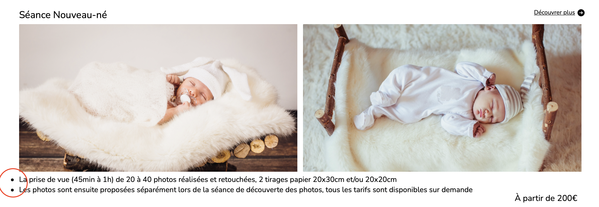
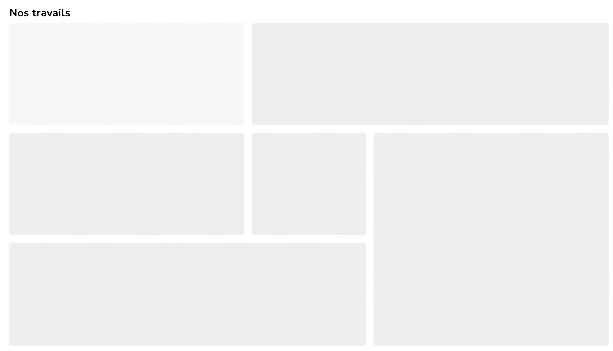

# welcomePhotograph

---

## Assignments

- Necessaries

  1. List of menu
  2. Grid in css

 

- Errors on solving

  1. List-style : prestation <em>fixed<em>
  2. <strike>gallery page</strike> <em>fixed<em>
  3. Favicon
     <em>fixed<em>

---

### Necessaries

: two options has to be contained

1. List of menu

      <!---->
      
    

2. Grid
   

---

### Errors on solving

1. <strike>List-style - prestation page<strike>
   
   : has to be same start line with photo  

2. <strike>Gallery page</strike>
     
   : On my local yes but photo doesn't show up in the page of gallery on git page
